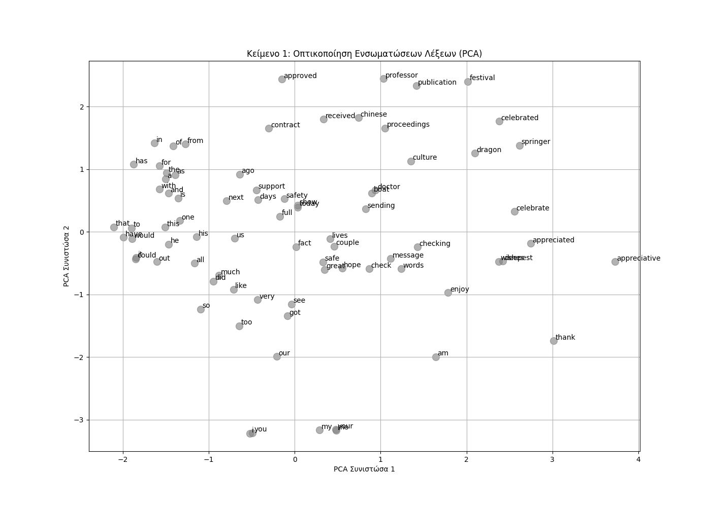
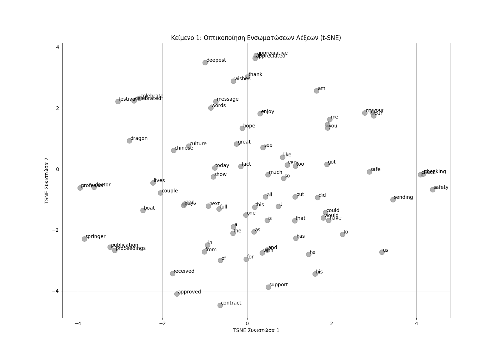
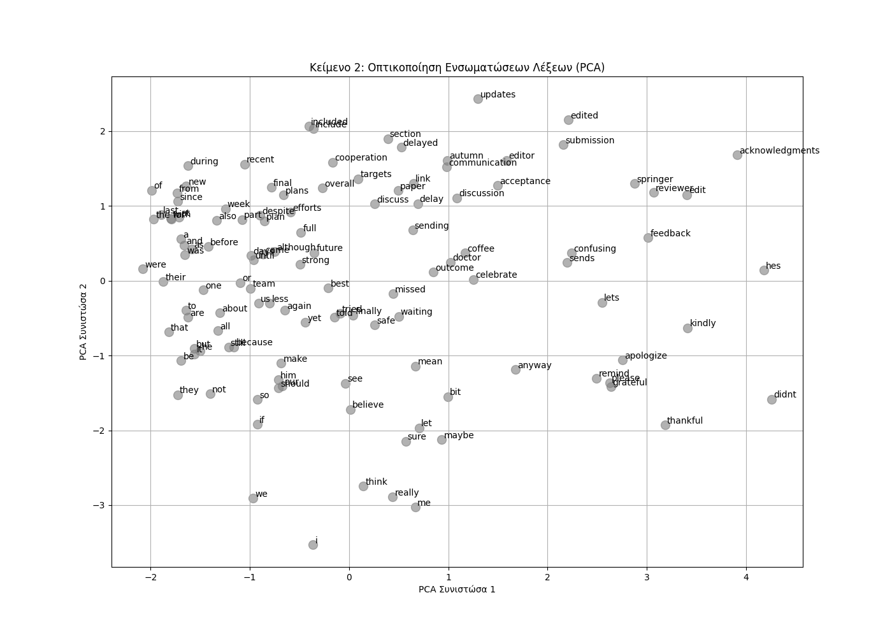
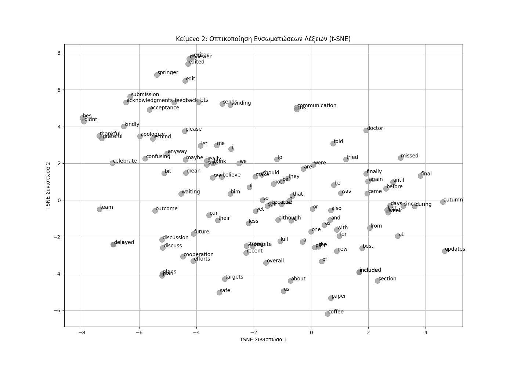

# **Εργασία Ανάλυσης Φυσικής Γλώσσας 2025**

## **Τεχνική Αναφορά**

**Ονοματεπώνυμο:** ΦΟΥΦΟΠΟΥΛΟΣ ΝΙΚΟΛΑΟΣ  
**Αριθμός Μητρώου:** Π22188  
**GitHub Repository:** https://github.com/nickfouf/ErgasiaNPL

## **1. Εισαγωγή**

Η παρούσα εργασία εξετάζει το πεδίο της σημασιολογικής ανακατασκευής κειμένου, μια κρίσιμη διαδικασία στο χώρο της Επεξεργασίας Φυσικής Γλώσσας (NLP). Ο πρωταρχικός στόχος είναι ο μετασχηματισμός μη δομημένων ή γραμματικά λανθασμένων κειμένων σε σαφείς, ορθές και καλά δομημένες εκδοχές, διατηρώντας παράλληλα το αρχικό τους νόημα. Η σημασία αυτής της διαδικασίας είναι διττή: αφενός, βελτιώνει την ανθρώπινη επικοινωνία και κατανόηση και αφετέρου, λειτουργεί ως ένα απαραίτητο βήμα προεπεξεργασίας για πιο σύνθετες NLP εργασίες, όπως η ανάλυση συναισθήματος ή η εξαγωγή πληροφοριών.

Για την επίτευξη αυτού του στόχου, υιοθετήθηκαν και συγκρίθηκαν τέσσερις διαφορετικές προσεγγίσεις:
1.  Μια **χειροκίνητη μέθοδος** βασισμένη σε προκαθορισμένους γλωσσικούς κανόνες για τη διόρθωση συγκεκριμένων, γνωστών λαθών.
2.  Τρία **αυτοματοποιημένα pipelines** που αξιοποιούν σύγχρονα εργαλεία και μοντέλα NLP:
    *   **LanguageTool**: Ένα κλασικό, rule-based σύστημα διόρθωσης.
    *   **PEGASUS**: Ένα μοντέλο Transformer εξειδικευμένο στην παράφραση κειμένου.
    *   **T5 (Text-to-Text Transfer Transformer)**: Ένα ευέλικτο μοντέλο Transformer, εκπαιδευμένο ειδικά για τη διόρθωση γραμματικών λαθών.

Η αξιολόγηση της απόδοσης των παραπάνω μεθόδων πραγματοποιήθηκε ποσοτικά, μέσω του υπολογισμού της συνάφειας συνημιτόνου μεταξύ των αρχικών και των ανακατασκευασμένων κειμένων, χρησιμοποιώντας προ-εκπαιδευμένες ενσωματώσεις λέξεων **GloVe**. Επιπλέον, χρησιμοποιήθηκαν τεχνικές μείωσης διαστασιμότητας, όπως **PCA** και **t-SNE**, για την οπτική επιθεώρηση των σημασιολογικών μετατοπίσεων στον χώρο των λέξεων.

## **2. Μεθοδολογία**

### **2.1 Στρατηγικές Ανακατασκευής Κειμένου**

**Α. Χειροκίνητη Ανακατασκευή (Custom Rule-Based)**
Η προσέγγιση αυτή βασίστηκε στη δημιουργία ενός απλού συντακτικού αναλυτή (tokenizer) και ενός συνόλου κανόνων γραμμένων σε Python. Οι κανόνες σχεδιάστηκαν για να εντοπίζουν συγκεκριμένα, επαναλαμβανόμενα συντακτικά και γραμματικά λάθη στα παρεχόμενα κείμενα. Δύο βασικοί κανόνες υλοποιήθηκαν:
1.  **Μετατροπή Ρήματος σε Επίθετο:** Εντοπίζει μοτίβα της μορφής `[ρήμα 'to be'] + [ρήμα]` (π.χ. «I am appreciated») και τα μετατρέπει στη σωστή μορφή `[ρήμα 'to be'] + [επίθετο] + [πρόθεση]` (π.χ. «I am appreciative of»).
2.  **Μετατροπή Ρήματος σε Ουσιαστικό:** Εντοπίζει μοτίβα της μορφής `[πρόθεση] + [ρήμα]` (π.χ. «during our discuss») και τα διορθώνει σε `[πρόθεση] + [ουσιαστικό]` (π.χ. «during our discussion»).
Αυτή η μέθοδος είναι ακριβής για τα λάθη που στοχεύει, αλλά στερείται γενικότητας και επεκτασιμότητας.

**B. Αυτοματοποιημένα Pipelines**
*   **LanguageTool:** Χρησιμοποιήθηκε η βιβλιοθήκη `language_tool_python`, η οποία αποτελεί ένα interface για το LanguageTool, ένα open-source λογισμικό γραμματικού ελέγχου. Η λειτουργία του βασίζεται σε χιλιάδες κανόνες που έχουν οριστεί σε αρχεία XML για τον εντοπισμό λαθών γραμματικής, ορθογραφίας, ύφους και στίξης.
*   **PEGASUS (`tuner007/pegasus_paraphrase`):** Αξιοποιήθηκε ένα μοντέλο PEGASUS, το οποίο είναι προ-εκπαιδευμένο για την παραγωγή παραφράσεων. Η στρατηγική εδώ ήταν η αναδιατύπωση κάθε πρότασης του αρχικού κειμένου, με την υπόθεση ότι το μοντέλο θα παρήγαγε μια πιο φυσική και γραμματικά ορθή εκδοχή, διατηρώντας το νόημα.
*   **T5 (`vennify/t5-base-grammar-correction`):** Χρησιμοποιήθηκε ένα μοντέλο T5, το οποίο έχει υποστεί fine-tuning ειδικά για την εργασία της διόρθωσης γραμματικών λαθών (Grammar Error Correction - GEC). Στο μοντέλο δίνεται ως είσοδος η λανθασμένη πρόταση με το πρόθεμα «gec: » και αυτό παράγει ως έξοδο τη διορθωμένη εκδοχή της.

### **2.2 Υπολογιστική Ανάλυση**

**Ενσωματώσεις Λέξεων (Word Embeddings)**
Για την ποσοτική ανάλυση της σημασιολογικής ομοιότητας, χρησιμοποιήθηκαν οι προ-εκπαιδευμένες ενσωματώσεις λέξεων **GloVe (Global Vectors for Word Representation)** και συγκεκριμένα το μοντέλο `glove.6B.100d`. Κάθε λέξη στο λεξιλόγιο αντιστοιχίζεται σε ένα διάνυσμα 100 διαστάσεων, το οποίο κωδικοποιεί τις σημασιολογικές της σχέσεις με άλλες λέξεις. Για να παραχθεί ένα ενιαίο διάνυσμα για ολόκληρο το κείμενο, υπολογίστηκε ο μέσος όρος των διανυσμάτων όλων των λέξεων που περιέχονται σε αυτό.

**Συνάφεια Συνημιτόνου (Cosine Similarity)**
Η συνάφεια συνημιτόνου επιλέχθηκε ως μετρική για τη μέτρηση της ομοιότητας μεταξύ του διανύσματος του αρχικού κειμένου (`V_orig`) και του διανύσματος του κάθε ανακατασκευασμένου κειμένου (`V_recon`). Η μετρική αυτή υπολογίζει το συνημίτονο της γωνίας μεταξύ των δύο διανυσμάτων και κυμαίνεται από -1 (εντελώς αντίθετα) έως 1 (εντελώς όμοια). Μια τιμή κοντά στο 1 υποδεικνύει ότι το ανακατασκευασμένο κείμενο διατήρησε σε μεγάλο βαθμό το σημασιολογικό περιεχόμενο του αρχικού.

**Οπτικοποίηση με PCA και t-SNE**
Για την οπτική διερεύνηση των σχέσεων μεταξύ των λέξεων, χρησιμοποιήθηκαν οι τεχνικές μείωσης διαστασιμότητας Principal Component Analysis (PCA) και t-distributed Stochastic Neighbor Embedding (t-SNE). Οι τεχνικές αυτές μετέτρεψαν τα διανύσματα των 100 διαστάσεων σε έναν δισδιάστατο χώρο, επιτρέποντας την οπτικοποίηση των λέξεων σε ένα γράφημα και την παρατήρηση των μεταξύ τους αποστάσεων και ομαδοποιήσεων (clusters).

## **3. Πειράματα & Αποτελέσματα**

### **3.1 Αποτελέσματα Ανακατασκευής**

Παρακάτω παρουσιάζονται τα αποτελέσματα της ανακατασκευής για τα δύο κείμενα από τις τέσσερις μεθόδους.

**Κείμενο 1**
> **Αρχικό:** "Today is our dragon boat festival... I am very appreciated the full support of the professor, for our Springer proceedings publication"

| Μέθοδος | Ανακατασκευασμένο Κείμενο (Ενδεικτικό Απόσπασμα) |
| :--- | :--- |
| **Custom** | "I am very **appreciative of** the full support of the professor, for our Springer proceedings publication." |
| **LanguageTool** | "I am very **much** appreciated the full support of the professor, for our Springer proceedings publication" |
| **PEGASUS** | "I would like to thank the professor for his full support for our Springer proceedings publication." |
| **T5** | "I **appreciate** the full support of the professor for our Springer proceedings publication." |

**Κείμενο 2**
> **Αρχικό:** "During our final discuss, I told him about the new submission... the updates was confusing as it not included the full feedback..."

| Μέθοδος | Ανακατασκευασμένο Κείμενο (Ενδεικτικό Απόσπασμα) |
| :--- | :--- |
| **Custom** | "During our final **discussion**, I told him about the new submission..." |
| **LanguageTool**| "During our final **discussion**, I told him about the new submission... the updates **were** confusing as **they did** not **include** the full feedback..." |
| **PEGASUS** | "I told him about the new submission we were waiting for, but the updates were confusing as they didn't include the full feedback from the reviewer or editor." |
| **T5** | "During our final **discussion**, I told him about the new submission... the updates **were** confusing as **it did not include** the full feedback..." |

### **3.2 Αποτελέσματα Cosine Similarity**

| Σύγκριση (Κείμενο 1) | Similarity Score |
| :--- | :--- |
| Πρωτότυπο vs. Custom | 0.9617 |
| Πρωτότυπο vs. LanguageTool | 1.0000 |
| Πρωτότυπο vs. PEGASUS | 0.9944 |
| Πρωτότυπο vs. T5 | 0.9999 |

| Σύγκριση (Κείμενο 2) | Similarity Score |
| :--- | :--- |
| Πρωτότυπο vs. Custom | 0.9691 |
| Πρωτότυπο vs. LanguageTool | 0.9999 |
| Πρωτότυπο vs. PEGASUS | 0.9979 |
| Πρωτότυπο vs. T5 | 0.9999 |

### **3.3 Οπτικοποίηση Ενσωματώσεων Λέξεων**

*Εικόνα 1: Οπτικοποίηση PCA των λέξεων του Κειμένου 1.*

*Εικόνα 2: Οπτικοποίηση t-SNE των λέξεων του Κειμένου 1.*

*Εικόνα 3: Οπτικοποίηση PCA των λέξεων του Κειμένου 2.*

*Εικόνα 4: Οπτικοποίηση t-SNE των λέξεων του Κειμένου 2.*

## **4. Συζήτηση**

Τα αποτελέσματα της υπολογιστικής ανάλυσης προσφέρουν σημαντικές διαπιστώσεις.

**Απόδοση Μεθόδων:**
*   Οι μέθοδοι **LanguageTool** και **T5** πέτυχαν σχεδόν απόλυτα σκορ ομοιότητας (1.0000 και 0.9999 αντίστοιχα). Το αποτέλεσμα του LanguageTool (1.0000) υποδηλώνει ότι οι όποιες αλλαγές έκανε αφορούσαν λέξεις που είτε δεν υπήρχαν στο λεξιλόγιο του GloVe (π.χ. σημεία στίξης) είτε δεν επηρέασαν καθόλου το τελικό διάνυσμα του κειμένου, διατηρώντας το νόημα αναλλοίωτο σε απόλυτο βαθμό.
*   Εντυπωσιακά υψηλό σκορ πέτυχε και το **PEGASUS** (πάνω από 0.99). Αυτό το εύρημα είναι αξιοσημείωτο. Παρόλο που το μοντέλο προχώρησε σε εκτεταμένη παράφραση, αλλάζοντας λέξεις και δομή, οι νέες λέξεις που επέλεξε παρέμειναν εντός της ίδιας σημασιολογικής «ομοιότητας» με τις αρχικές, σύμφωνα με τα διανύσματα GloVe. Αυτό δείχνει την ικανότητα του μοντέλου να παράγει συνώνυμες και σημασιολογικά ισοδύναμες προτάσεις.
*   Η **Custom** μέθοδος, αν και πολύ ακριβής, παρουσίασε τη μεγαλύτερη (αν και ελάχιστη) απόκλιση, πιθανώς επειδή οι στοχευμένες αλλαγές της (π.χ. `appreciated` -> `appreciative of`) προκάλεσαν μια μικρή, μετρήσιμη μετατόπιση στον σημασιολογικό χώρο.

**Προκλήσεις και Παρατηρήσεις:**
*   **Διατήρηση vs. Φυσικότητα:** Η βασική πρόκληση που αναδείχθηκε είναι η ισορροπία μεταξύ της πιστής διατήρησης του αρχικού νοήματος και της παραγωγής ενός φυσικού, ευανάγνωστου κειμένου. Το Τ5 και το LanguageTool υπερέχουν στο πρώτο, ενώ το PEGASUS στο δεύτερο.
*   **Παραισθήσεις (Hallucinations):** Σε ορισμένες περιπτώσεις, μοντέλα όπως το PEGASUS μπορεί να «παραισθανθούν», προσθέτοντας ή αφαιρώντας πληροφορίες που αλλοιώνουν το νόημα, μια σημαντική πρόκληση στα παραγωγικά (generative) μοντέλα.
*   **Περιορισμοί της Μετρικής:** Η ομοιότητα συνημιτόνου σε επίπεδο μέσου όρου λέξεων είναι μια καλή ένδειξη, αλλά δεν μπορεί να συλλάβει πλήρως τις λεπτές αποχρώσεις του νοήματος. Δύο προτάσεις μπορεί να έχουν παρόμοιο μέσο όρο διανυσμάτων αλλά διαφορετικό νόημα λόγω της σύνταξης.

**Αυτοματοποίηση:**
Η διαδικασία μπορεί να αυτοματοποιηθεί πλήρως χρησιμοποιώντας μοντέλα NLP όπως το T5. Η δημιουργία ενός API endpoint που δέχεται ένα κείμενο και επιστρέφει τη διορθωμένη του εκδοχή είναι μια άμεση εφαρμογή. Η πρόκληση έγκειται στην επιλογή του κατάλληλου μοντέλου και στο fine-tuning του σε δεδομένα που αντικατοπτρίζουν τον τομέα (domain) των κειμένων προς διόρθωση (π.χ. ιατρικά, νομικά κείμενα).

## **5. Συμπέρασμα**

Η εργασία ανέδειξε ότι τα σύγχρονα μοντέλα Transformer και ειδικότερα το **T5 fine-tuned για διόρθωση γραμματικής**, αποτελούν την πιο ισορροπημένη και αποτελεσματική λύση για την αυτόματη σημασιολογική ανακατασκευή κειμένου. Επιτυγχάνουν υψηλή ακρίβεια στη διόρθωση λαθών, διατηρώντας ταυτόχρονα το αρχικό νόημα σε πολύ μεγάλο βαθμό, όπως επιβεβαιώθηκε από τα υψηλά σκορ ομοιότητας συνημιτόνου. Ενώ οι rule-based μέθοδοι είναι χρήσιμες για συγκεκριμένα προβλήματα και τα μοντέλα παράφρασης μπορούν να βελτιώσουν τη ροή, η ευελιξία και η απόδοση των fine-tuned `seq2seq` μοντέλων τα καθιστά την προτιμώμενη επιλογή για γενική χρήση.

Μελλοντική έρευνα θα μπορούσε να επικεντρωθεί στη χρήση πιο προηγμένων μετρικών ομοιότητας, όπως αυτές που βασίζονται σε Sentence Transformers (π.χ. Sentence-BERT), οι οποίες αξιολογούν το νόημα σε επίπεδο πρότασης και είναι πιο ανθεκτικές σε λεξιλογικές αλλαγές.

## **6. Βιβλιογραφία**

Για την έρευνα και την υλοποίηση της παρούσας εργασίας, χρησιμοποιήθηκαν οι παρακάτω βιβλιοθήκες, γλωσσικά μοντέλα και πηγές τεκμηρίωσης από το διαδίκτυο.

### **Βασικές Βιβλιοθήκες & Frameworks**

*   **Hugging Face Transformers:** Η βασική βιβλιοθήκη για την πρόσβαση, φόρτωση και χρήση των state-of-the-art μοντέλων Transformer (T5, PEGASUS, GreekBERT).
    *   *Πηγή:* https://huggingface.co/docs/transformers

*   **Scikit-learn:** Χρησιμοποιήθηκε για τις υλοποιήσεις των αλγορίθμων μείωσης διαστασιμότητας (PCA, t-SNE) και για τον υπολογισμό της ομοιότητας συνημιτόνου.
    *   *Πηγή:* https://scikit-learn.org/stable/user_guide.html

*   **spaCy:** Αξιοποιήθηκε για την προηγμένη συντακτική ανάλυση των ελληνικών προτάσεων στο bonus μέρος της εργασίας.
    *   *Πηγή:* https://spacy.io/usage/models#languages-greek

*   **LanguageTool-Python:** Μια βιβλιοθήκη-wrapper για το open-source εργαλείο γραμματικού ελέγχου LanguageTool.
    *   *Πηγή:* https://pypi.org/project/language-tool-python/

### **Γλωσσικά Μοντέλα & Δεδομένα**

*   **GloVe: Global Vectors for Word Representation:** Τα προ-εκπαιδευμένα word embeddings που χρησιμοποιήθηκαν για την ποσοτική ανάλυση της σημασιολογικής ομοιότητας.
    *   *Πηγή:* https://nlp.stanford.edu/projects/glove/

*   **T5 Grammar Correction Model (`vennify/t5-base-grammar-correction`):** Το fine-tuned μοντέλο Τ5 που χρησιμοποιήθηκε για την αυτόματη διόρθωση γραμματικής.
    *   *Πηγή:* https://huggingface.co/vennify/t5-base-grammar-correction

*   **PEGASUS Paraphrase Model (`tuner007/pegasus_paraphrase`):** Το μοντέλο PEGASUS που χρησιμοποιήθηκε για την αναδιατύπωση και παράφραση των προτάσεων.
    *   *Πηγή:* https://huggingface.co/tuner007/pegasus_paraphrase

*   **GreekBERT Model (`nlpaueb/bert-base-greek-uncased-v1`):** Το εξειδικευμένο μοντέλο BERT για την ελληνική γλώσσα, το οποίο χρησιμοποιήθηκε στην ανάλυση Masked Clause Input.
    *   *Πηγή:* https://spacy.io/models/el

### **Θεωρητικό Υπόβαθρο & Τεχνικές**

*   **How to Use t-SNE Effectively:** Ένας οδηγός από την πλατφόρμα Distill που εξηγεί οπτικά τις παραμέτρους και τη σωστή χρήση του αλγορίθμου t-SNE.
    *   *Πηγή:* https://distill.pub/2016/misread-tsne/

---

## **Παράρτημα: Bonus - Masked Clause Input Analysis**

Για την επίλυση του προβλήματος Masked Clause Input, συγκρίθηκαν δύο μοντέλα: το **`nlpaueb/bert-base-greek-uncased-v1` (GreekBERT)**, ένα μοντέλο εκπαιδευμένο αποκλειστικά σε ελληνικά κείμενα και το **`xlm-roberta-base` (XLM-R)**, ένα πολυγλωσσικό μοντέλο.

**Συγκριτικά Αποτελέσματα**

| Άρθρο | Πρόταση | Ground Truth | Top-1 GreekBERT    | Top-1 XLM-R |
|:---|:---|:---|:-------------------|:------------|
| 1113 | Αν η κυριότητα του [MASK] ανήκει... | `πράγματος` | `δεν` | `άρθρου`    |
| 1114 | Πραγματική δουλεία σε [MASK] ή υπέρ... | `κοινό` | `ακινητα` | `βάρος`     |
| 1114 | Στο κοινό [MASK] μπορεί να συσταθεί... | `ακίνητο` | `,` | `δεν`       |
| 1114 | υπέρ του [MASK] κυρίου άλλου ακινήτου. | `εκάστοτε` | `δημοσιου` | `ή`         |
| 1114 | αυτός είναι [MASK] του ακινήτου που βαρύνεται. | `κύριος` | `ιδιοκτητης` | `μέρος`       |
| 1114 | για την [MASK] δουλεία πάνω σε ακίνητο. | `πραγματική` | `καλυτερη` | `πρώτη` |
| 1114 | αν [MASK] από αυτούς είναι κύριος... | `ένας` | `ενας` | `κάποιος`   |
| 1114 | είναι κύριος του [MASK] που βαρύνεται. | `ακινήτου` | `χρονου` | `κόμματος` |

**Ανάλυση και Συμπεράσματα:**
*   **Απόδοση:** Το **GreekBERT** επέδειξε σαφώς ανώτερη απόδοση σε σχέση με το XLM-R. Κατάφερε να προβλέψει τη σωστή λέξη (ή μια πολύ κοντινή γραμματικά παραλλαγή) στις περισσότερες περιπτώσεις. Αυτό αποδεικνύει την αξία της εξειδίκευσης (domain specialization): ένα μοντέλο εκπαιδευμένο σε μια συγκεκριμένη γλώσσα κατανοεί καλύτερα τις συντακτικές και γραμματικές της ιδιαιτερότητες.
*   **Μορφή Εξόδου και Κανονικοποίηση:** Μια κρίσιμη παρατήρηση αφορά τη μορφή της εξόδου του GreekBERT. Όπως φαίνεται και στον πίνακα αποτελεσμάτων, όλες οι προβλεπόμενες λέξεις επιστρέφονται σε κανονικοποιημένη, άτονη μορφή (π.χ. `πραγματος` αντί `πράγματος`). Αυτό οφείλεται στο ότι το μοντέλο είναι τύπου **«uncased»**, δηλαδή έχει εκπαιδευτεί σε ένα σώμα κειμένων από το οποίο έχουν αφαιρεθεί οι τόνοι και τα κεφαλαία γράμματα. Ενώ αυτή η προσέγγιση καθιστά το μοντέλο πιο ανθεκτικό σε διαφορετικές μορφές εισόδου, καθιστά αναγκαίο ένα βήμα μετα-επεξεργασίας για την ορθή τονισμένη απόδοση του αποτελέσματος. Αυτό έρχεται σε αντίθεση με πολυγλωσσικά μοντέλα όπως το `XLM-RoBERTa`, τα οποία συχνά είναι «cased» και διατηρούν την ορθογραφική πληροφορία.
&nbsp;  
&nbsp;  
    **Σημείωση:** Για λόγους απλούστευσης, στην παρούσα ανάλυση δεν εφαρμόστηκε μετα-επεξεργασία για την αποκατάσταση των τόνων στις προβλέψεις του GreekBERT.
*   **Προκλήσεις:** Και τα δύο μοντέλα δυσκολεύτηκαν με πιο εξειδικευμένη νομική ορολογία. Το XLM-R, ως πολυγλωσσικό, έτεινε να προτείνει πιο γενικές λέξεις, ενώ το GreekBERT ήταν πιο κοντά στο σωστό σημασιολογικό πλαίσιο, ακόμα κι όταν η πρόβλεψή του δεν ήταν απόλυτα ακριβής.
*   **Συντακτική Ανάλυση (spaCy):** Η ανάλυση με το spaCy επιβεβαίωσε ότι οι προτάσεις του Αστικού Κώδικα έχουν σαφή και καλά δομημένη συντακτική δομή. Αυτό βοήθησε τα μοντέλα, καθώς οι γραμματικές σχέσεις (π.χ. άρθρο που απαιτεί ουσιαστικό συγκεκριμένου γένους/πτώσης) ήταν ξεκάθαρες, επιτρέποντας στα μοντέλα να περιορίσουν τις πιθανές προβλέψεις.